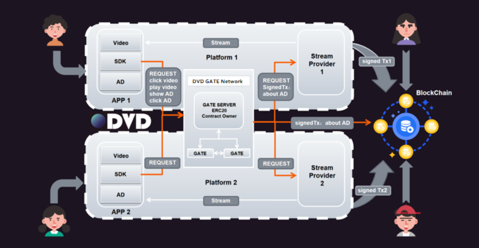
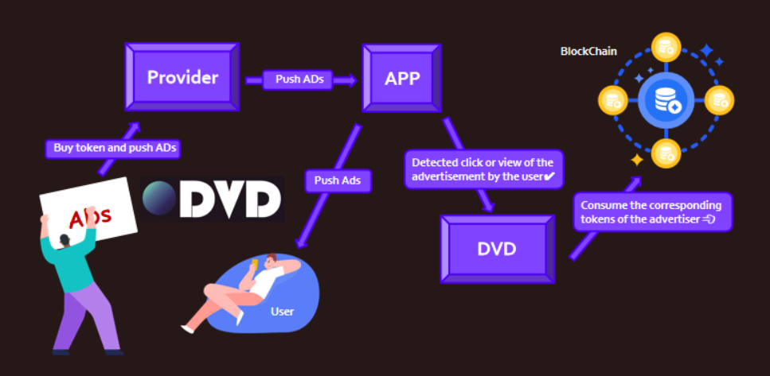

# DVD

## Project Introduction

**Project Name:** 

Decentralized-Video-revenue-Distribution

**Introduction:**

Our project DVD quantifies the value generated from the video industry through tokens and utilizes the market self-regulation mechanism to fairly distribute the benefits that each party should receive from the value they create.

**Team Member:**

Team details websit: [bewater campaigns](https://build.bewater.xyz/en/campaigns/62/teams/1010)

[@NavaFee](https://github.com/NavaFee) 

[@trenlinhuang](https://github.com/trenlinhuang)

[@booker](https://github.com/bookerhuang)

[@LilyWest](https://github.com/lilywest2022)

**Competition website**：

[2023ETH-HongKong-Hackathon](https://build.bewater.xyz/en/campaigns/mUwy-2023ETH-HongKong-Hackathon)

## Problem Statement

### Problems

In the video industry, there are primarily three key parties with interests:

1. Video service providers
2. Video creators, and
3. Advertisers

The current value flow process is as follows:

Video traffic is generated as users play videos

Video platforms with more users and more traffic have a higher advertising value

Advertisers gain exposure rights by paying a fee.

The problem with this process is:

1. Users may find it troublesome to manage their videos (as they need to upload them to many platforms to gain more views)
2. Revenue distribution ratio is totally determined by the video platform.
3. Advertisers are uncertain about the specific exposure of their ads.

### Solutions

Our solutions are:

1. Using tokens to quantify user traffic generated from videos.
2. Video creators and platforms receive tokens in accordance with the ratio published by the platform on chain.
3. Users and platforms can sell tokens to advertisers, and advertisers can then acquire advertising exposure rights by consuming tokens.

The advantages are:

1. Tokens serve as a reflection of user traffic.
2. Clear and transparent distribution of the value generated by videos.
3. Precise consumption of capital from advertisers to ad exposure.
4. Users have the freedom to switch platforms that can offer them greater benefits.
5. App of any platform can access videos from other platforms, increasing traffic and token acquisition for both parties, so users only need to upload videos to one platform.
6. Platforms compete to attract video creators to host their content, thus the token distribution ratios can be market-driven, converging toward a reasonable level.
7. Any video service group seeking opportunities in the web3 industry can freely join the ecosystem.

## Architecture and Key Business Processes

### The general architecture

The Gate Network plays a role in the system as it manages the conversion of user traffic and tokens. It operates as a centrally managed distributed network.

The app interacts directly with the Gate Network instead of the blockchain. This decision allows video viewers to use web3 products just as they would with web2 products. It also avoids the TPS limitations imposed by the limited throughput of blockchain systems.

The value flow process in the system can be divided into the value creation process and the value realization process.

### The value creation process

Token generation and distribution

1. When the platform intends to convert user traffic into tokens, it needs to send the request to play a video to the Gate Network
2. Gate Network, based on the platform's on-chain revenue sharing ratio (such as., 7:3 between users and the platform), mints a specific quantity of tokens for both the video creator and the platform. It then sends this signed transaction and the original video playing request to the platform server.
3. Upon verification of the transaction by the platform server, a video segment is pushed back to the user. The platform can send the transaction to the blockchain at any time.
4. This process is repeated when the video needs to preload the next segment.

In the context of cross-platform video playback, the generated traffic needs to be distributed among two platforms and the video creator (e.g., 7:1:2 between users, viewing platform, and hosting platform), with the token distribution ratio also determined by the video hosting platform.

### The value realization process

Token exchange and burn

1. Before advertisers can place advertisements, they need to exchange tokens from various video platforms and content creators using other cryptocurrencies.
2. Once the advertisers specify the platform for advertising, they must approve tokens for Gate. For each exposure, Gate will burn a certain quantity of tokens from the advertiser (the exact amount is determined by the platform).

## Market Analysis

### Business Model

Charging a certain percentage of fees when users and platforms exchange tokens for cryptocurrency from advertisers.

### Market Share

| company       | Advertising revenue                    |
| ------------- | -------------------------------------- |
| bilibili      | RMB 5.066 billion                      |
| iQIYI         | RMB 5.332 billion                      |
| KuaiShou      | RMB 49 billion                         |
| Youku Youtube | RMB 207.18 billion  RMB 213.90 billion |
| Tiktok        | RMB 550.264 billion                    |

The video industry has a vast market, but there are relatively few businesses operating in this space in web3, leaving significant room for start-ups looking to enter the web3 video industry. Our project tokenizes the flow of real-world value using cryptocurrencies, offering a viable solution for the web3 transformation of the video industry.

## DEMO

[YouTube](https://youtu.be/pqs76fcAOUs) length: 2m45s

